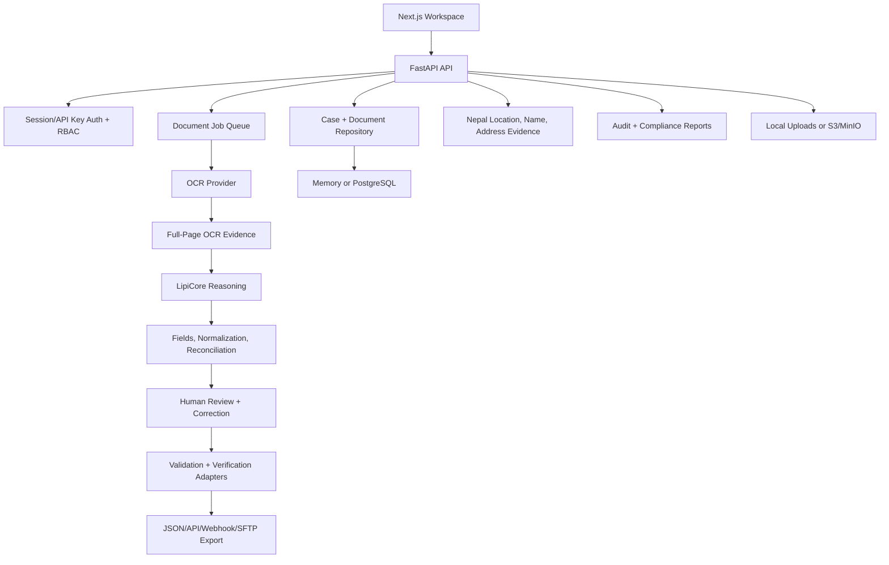
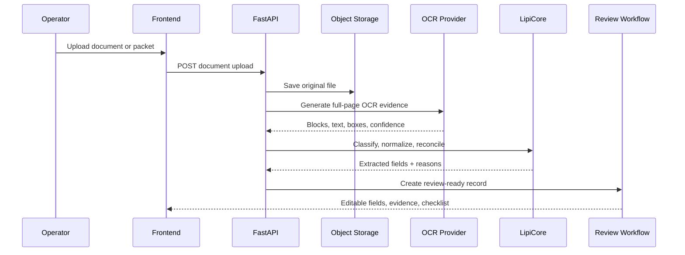

# LipiOCR Architecture

LipiOCR is an enterprise document intelligence system for Nepal financial workflows. It is designed around evidence-backed extraction, human review, auditability, and integration into existing institution systems.

## Core Principles

- Reviewer-first: uncertain OCR/ICR fields remain editable and auditable.
- Evidence-backed: exported values trace to page, block, OCR text, template field, reviewer correction, or deterministic rule.
- Bilingual by design: Nepali and English fields are paired, normalized, translated/transliterated where useful, and reconciled.
- No fake integrations: registry, AML, liveness, CBS, LOS, DMS, and SFTP checks must show configured, sandbox, not-configured, or failed states.
- Tenant-aware: production data belongs to a tenant, user, role, branch, and audit context.
- On-prem first: deployment must work inside an institution network before SaaS assumptions are added.

## System View

## Nepal Document Reality

Nepal KYC documents are not one uniform template. Citizenship documents have old and new layouts, front and back sides, English summary blocks on some backs, photocopied front/back pairs on one page, handwritten overwrites, stamps, low-resolution phone photos, and mixed Nepali/English fields. Financial institutions also receive ASBA forms, account-opening forms, KYC refresh forms, and supporting IDs in one packet.

LipiOCR handles this with layered extraction:

1. Capture full-page OCR evidence first.
2. Detect document type and likely page surface: front, back, combined front/back, form page, receipt, or unknown page.
3. Apply permanent Nepal identity templates where the document is stable enough.
4. Apply tenant templates for institution-specific forms.
5. Use LipiCore reasoning and reference datasets to map remaining fields.
6. Route uncertain fields to reviewer correction instead of silently exporting guessed values.

## Backend Modules

| Module | Responsibility |
| --- | --- |
| `app/main.py` | Main API surface, case/document workflows, auth, upload previews, jobs, review, export. |
| `app/routers/` | Focused routers for health, integration manifest, templates, tenants, and compliance. |
| `app/core/config.py` | Environment-backed runtime settings. |
| `app/models.py` | Pydantic domain models for workflows and API payloads. |
| `app/repositories/` | Data persistence abstraction for memory and SQL modes. |
| `app/db/` | SQLAlchemy models and database session setup. |
| `app/jobs/` | Queue, job models, retry, and synchronous runner used by current worker flow. |
| `app/security/` | RBAC, sessions, tenant context, upload limits, signed previews. |
| `app/services/ocr.py` | Mock, Tesseract, PaddleOCR, and Gemma vision OCR providers. |
| `app/services/gemma.py` | OpenAI-compatible LipiCore client wrapper. |
| `app/services/document_intelligence.py` | Document classification, bilingual normalization, field pairing, confidence repair. |
| `app/services/enterprise_extraction.py` | Enterprise document processing orchestration. |
| `app/services/templates.py` | Built-in and coordinate-template extraction support. |
| `app/services/template_profiles.py` | Template drafts, profiles, approval, rollback, import/export. |
| `app/services/nepal_locations.py` | Nepal province, district, local-level, legacy VDC, and ward resolution. |
| `app/services/address_evidence_store.py` | Tenant-safe address evidence storage for road, street, tole, and area aliases. |
| `app/services/address_intelligence.py` | Address candidate scoring from registry and address evidence. |
| `app/services/nepali_name_lexicon.py` | Nepali-name lexicon suggestions and bilingual name repair candidates. |
| `app/services/integrations.py` | Export profiles, webhook test payloads, embedded review links. |
| `app/integrations/` | Idempotency, webhook delivery signing, SFTP batch delivery receipts. |
| `app/tenancy/` | Tenant registry, isolation checks, tenant-scoped object keys. |
| `app/compliance/` | Access review, audit integrity, retention, export, and backup reports. |

## Frontend Modules

| Route | Purpose |
| --- | --- |
| `/` | Product home and product intro. |
| `/dashboard` | Command center for platform status and work queues. |
| `/cases` | Case intake, selected case detail, review, validation, verification, export. |
| `/documents` | Standalone or applicant-linked document processing and full-page evidence. |
| `/review` | Maker-checker review workflow, comments, rework, correction capture. |
| `/verification` | Adapter status, configured checks, case verification results. |
| `/templates` | Template studio, extraction pipeline, draft/profile governance. |
| `/integrations` | Export profiles, webhook/SFTP operations, retry queue, payload review. |
| `/analytics` | Accuracy analytics, correction trends, benchmark summaries. |
| `/admin` | Tenant, RBAC, audit, compliance, readiness posture, and address dataset controls. |

The frontend uses a top module switcher rather than a heavy sidebar. API calls go through `frontend/src/lib/api-client.ts`, which handles base URL resolution, reverse-proxy base paths, credentials, and friendly auth errors.

## Document Processing Flow

## LipiCore Intelligence Layer

LipiCore is the product-facing name for the reasoning layer. The current backend can use deterministic local logic or a Gemma 4 26B OpenAI-compatible endpoint.

Responsibilities:

- Classify known and unknown Nepal financial documents.
- Pair bilingual fields such as `name_ne` and `name_en`.
- Preserve original OCR text and derive normalized values separately.
- Transliterate/translate values where useful for downstream systems.
- Convert BS and AD dates while retaining both representations.
- Compare identity fields across citizenship, National ID, passport, driving license, bank forms, ASBA forms, and KYB documents.
- Repair confidence only when supporting evidence exists, and store the reason.

Confidence repair must not silently overwrite OCR. A repaired field should retain:

- Original OCR value.
- Corrected or normalized value.
- Source field or source document used.
- Confidence before and after repair.
- Audit reason.

## Reference Intelligence

The reference layer is deterministic and reviewer-safe. It suggests candidates; it does not auto-approve customer data without evidence.

| Reference | Purpose | Privacy rule |
| --- | --- | --- |
| Nepal location registry | Resolve province, district, municipality/gaunpalika, legacy VDC wording, and ward. | Shared safe reference. |
| Address evidence store | Match road, street, tole, area, and aliases against tenant-approved evidence. | Tenant-private by default. Shared reference requires platform approval. |
| Nepali name lexicon | Suggest likely Nepali/romanized name corrections, such as `kaki` -> `karki`, when supported by lexicon or bilingual pair evidence. | Approved lexicon only; raw customer names stay outside Git. |
| Bilingual field pairs | Compare Nepali and English fields from the same or related documents. | Preserve both original values and correction reasons. |

Full home addresses and reviewer corrections are personal data. They must not be promoted into shared address evidence unless they have been reduced to non-personal road, tole, or area records and approved by the institution.

## Template Strategy

LipiOCR uses two extraction paths:

1. Full-page extraction for unknown or variable documents.
2. Template extraction for known, repeated institution forms.

Template profiles are tenant-scoped and support:

- Draft creation.
- Multipage sample uploads, including PDFs expanded into page images.
- Field boxes, labels, field types, language hints, and validation hints.
- Manual add, resize, move, and remove operations in the template editor.
- Approval.
- Rollback.
- Import/export.
- Test runs against extracted fields.

Coordinate templates are useful for stable bank, C-ASBA, account-opening, and onboarding forms. Full-page LipiCore extraction remains necessary for unknown or noisy uploads.

Permanent templates are reserved for Nepal identity documents that apply across institutions:

- Citizenship certificate.
- National Identity Card.
- Passport.
- Smart driving license.

Tenant admins can create and approve institution templates. Only `super_admin` can revise permanent Nepal identity templates.

## Tenancy And Security

Tenant boundaries are enforced in multiple layers:

- Auth principal includes `tenant_id`, role, branch, and auth method.
- RBAC controls endpoint permissions.
- Tenant helpers reject cross-tenant access for non-system principals.
- Object keys are namespaced under tenant segments.
- Templates, cases, documents, and reports are filtered by tenant context where supported.

Production must keep tenant isolation tests passing before any SaaS release.

## Persistence And Storage

Development defaults:

- Repository: memory.
- Storage: local filesystem.
- OCR: mock.
- Auth: disabled.

Production shape:

- Repository: PostgreSQL.
- Storage: S3/MinIO.
- OCR: Gemma vision, PaddleOCR, Tesseract, or provider adapter.
- Jobs: async worker flow backed by queue and retry semantics.
- Auth: session or API-key auth enabled, with institution SSO planned.
- Reference stores: mounted address evidence, mounted Nepali name lexicon, mounted template stores, and benchmark manifests.

## Integrations

Integration design is deliberately explicit:

- REST export profiles return deterministic payloads.
- Webhook payloads are signed with HMAC-SHA256.
- Webhook and SFTP deliveries produce idempotency keys and delivery receipts.
- Embedded review links use signed preview/review tokens.
- External checks return `not_configured` until real institution credentials exist.

## Compliance Operations

Compliance reports currently cover:

- Access review.
- Audit integrity.
- Retention posture.
- Backup readiness.
- Export delivery receipts.

Runbooks cover incident response and disaster recovery. These are starting points for institution-specific procedures, not replacements for a bank's security governance.
