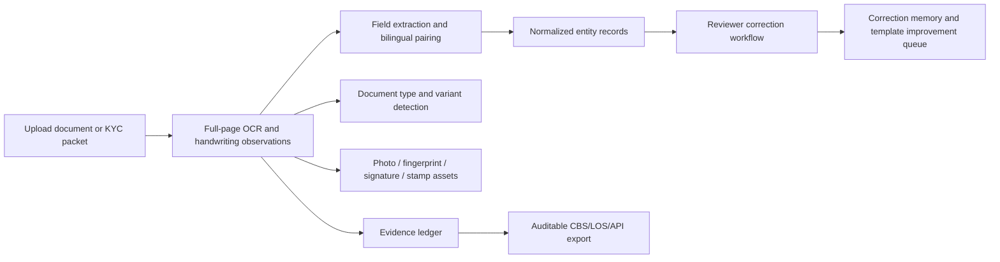

# Nepal Document Intelligence Design

## Goal
Build LipiOCR into a Nepal-first KYC document intelligence platform that goes beyond OCR/ICR by classifying document variants, retaining every OCR observation, extracting visual evidence assets, reconciling bilingual identity fields, and learning from reviewer corrections.

## Problem Context
Nepal financial institutions receive old and new citizenship certificates, national ID cards, passports, driving licenses, ASBA/IPO forms, bank forms, and many ad hoc KYC documents. These documents can contain Nepali text, English text, handwriting, photos, signatures, fingerprints, stamps, and incomplete or inconsistent bilingual values. A production product must not simply show OCR boxes; it must create a reviewer-safe evidence ledger that can be corrected, exported, audited, and improved over time.

## Recommended Approach
Use a layered intelligence model:

1. **Full evidence ledger**
   Every OCR block becomes a durable ledger entry with page, bbox, language, confidence, block type, mapped field if known, and asset classification if relevant. This prevents unknown documents from becoming “unstructured noise”.

2. **Nepal document variant registry**
   Classify both broad type and variant family, such as old district citizenship, national ID smart card, MRP passport, smart driving license, ASBA form, or generic financial form. The registry uses OCR signals now and can later be backed by layout embeddings.

3. **Asset extraction layer**
   Detect photo, signature, fingerprint, stamp/seal, and chip regions from OCR/layout blocks and store them as document assets. These are reviewable evidence objects, not ordinary fields.

4. **Bilingual entity records**
   Promote paired fields into person/contact/identifier entities while keeping original Nepali, original English, normalized values, transliterations, source fields, confidence, and audit reason.

5. **Reviewer-safe correction memory**
   Reviewer corrections become improvement signals grouped by document type, variant, field, and handwriting involvement. The product can report which layouts and fields need template tuning without silently retraining or overwriting values.

## Data Flow

## Backend Units
- `backend/app/models.py`: add document asset, ledger entry, document intelligence metadata fields.
- `backend/app/services/document_intelligence.py`: own variant detection, evidence ledger construction, asset detection, entity records, and correction memory.
- `backend/app/services/enterprise_extraction.py`: continue calling `apply_document_intelligence` so all upload paths get the same intelligence payload.
- `backend/app/main.py`: persist/copy intelligence fields for standalone library documents and linked application documents.
- `backend/app/services/accuracy_analytics.py`: expose correction memory alongside existing accuracy analytics.

## Frontend Units
- `frontend/src/types/workspace.ts`: type intelligence assets, ledger entries, entity records, and document variant metadata.
- `frontend/src/components/enterprise-workspace.tsx`: show the embedded intelligence for both standalone and application documents, including variant, asset counts, entity records, and ledger samples.

## Testing
Backend tests must prove:
- Citizenship variant detection works for Nepal old/new style signals.
- Assets are detected and attached to documents.
- Evidence ledger preserves all OCR blocks.
- Bilingual entity records keep originals plus normalized values.
- Standalone document upload returns intelligence fields.
- Correction memory summarizes reviewer corrections by field and document variant.

Frontend tests must prove:
- Workspace types expose the new intelligence shape.
- Build/lint succeeds after UI integration.

## Non-Goals
- No promise of 99% accuracy without a benchmark dataset.
- No silent overwriting of OCR values.
- No automatic training loop in this phase.
- No fraud/signature verification claim.
