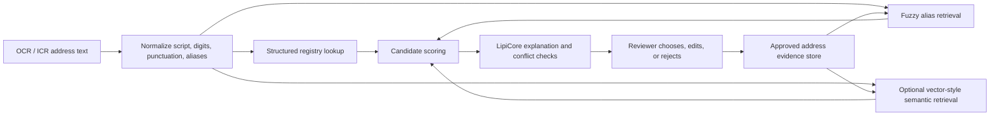
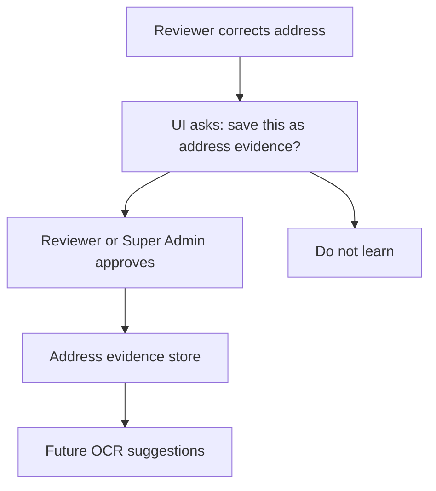

# Address Intelligence RAG Design

## Goal
Build a Nepal-first address intelligence layer for LipiOCR that can normalize, cross-check, and suggest corrected address fields from messy OCR/ICR output. The system should support financial-institution KYC workflows by turning raw address text into structured, auditable fields such as province, district, municipality/gaunpalika, legacy VDC, ward, street, road, tole, and full address.

## Problem Context
KYC documents in Nepal rarely contain addresses in one consistent format. The same customer may submit citizenship certificates, bank forms, ASBA forms, passports, and licenses with address values written in Nepali, English, mixed script, handwriting, old VDC terminology, missing district names, misspelled road names, or incomplete ward/local-level details.

LipiOCR already has a Nepal administrative location registry and a Nepali name lexicon. The next step is to generalize that idea into a retrieval-backed address evidence system. The retrieval layer should behave like RAG, but with financial-grade controls: trusted structured data first, fuzzy/vector retrieval second, LipiCore reasoning only as a ranking and explanation layer, and reviewer approval before learning.

## Recommended Architecture
Use a hybrid structured-plus-retrieval model:



This is not a free-form chatbot over addresses. It is an evidence retrieval and scoring system. Every suggestion must carry source records, score components, and audit reasons.

## Data Sources
### 1. Administrative Registry
This is the strongest source of truth and should be seeded first.

Required fields:
- province code and name in English/Nepali
- district code and name in English/Nepali
- local level code and name in English/Nepali
- local level type: mahanagarpalika, upamahanagarpalika, nagarpalika, gaunpalika
- legacy wording aliases: VDC, ga.vi.sa, na.pa., ma.na.pa., municipality, rural municipality
- ward number when available from document text

### 2. Area / Tole / Street / Road Registry
The user does not currently have this dataset, so it should be created gradually.

Supported source types:
- `manual_seed`: entered by Super Admin or imported from CSV
- `reviewer_approved`: learned from reviewed KYC corrections
- `institution_private`: tenant-specific address entries
- `public_reference`: future approved public/open dataset

### 3. Reviewer-Approved Address Memory
This should never learn directly from raw OCR. It learns only when a reviewer approves or creates an address correction.

Examples:
- OCR: `Kathmadu Metropolitian ward 26 Samakushi`
- approved: `Kathmandu Metropolitan City, Ward 26, Samakhusi`
- evidence: spelling correction, municipality match, ward match, area/tole match

## Core Data Model
### Address Evidence Record
```json
{
  "id": "addr_ev_01",
  "tenant_id": "demo-institution",
  "visibility": "tenant_private",
  "kind": "area_or_tole",
  "province_code": "3",
  "province_name": "Bagmati Pradesh",
  "district_code": "27",
  "district_name": "Kathmandu",
  "local_level_code": "KTM-METRO",
  "local_level_name": "Kathmandu Metropolitan City",
  "local_level_type": "Mahanagarpalika",
  "ward": "26",
  "name_en": "Samakhusi",
  "name_np": "सामाखुसी",
  "aliases_en": ["Samakhusi Chowk", "Samakhusi Area", "Samakushi"],
  "aliases_np": ["सामाखुसी चोक"],
  "legacy_aliases": [],
  "source": "reviewer_approved",
  "confidence_weight": 0.85,
  "approved_by": "operator_id",
  "created_from_document_id": "doc_id",
  "created_at": "2026-06-01T00:00:00Z"
}
```

### Address Candidate
```json
{
  "target_field": "permanent_address",
  "original_ocr_value": "Kathmadu Metropolitian ward 26 Samakushi",
  "suggested_value": "Kathmandu Metropolitan City, Ward 26, Samakhusi",
  "structured": {
    "province": "Bagmati Pradesh",
    "district": "Kathmandu",
    "local_level": "Kathmandu Metropolitan City",
    "ward": "26",
    "area_or_tole": "Samakhusi"
  },
  "confidence": 0.91,
  "status": "suggested",
  "sources": ["nepal_location_registry", "address_evidence_store", "fuzzy_alias_match"],
  "score_breakdown": {
    "district": 0.24,
    "local_level": 0.24,
    "ward": 0.18,
    "area_or_tole": 0.16,
    "script_alias": 0.06,
    "reviewed_memory": 0.03
  },
  "audit_reason": "District and ward matched; municipality spelling corrected; area matched reviewer-approved Samakhusi alias."
}
```

## Retrieval and Scoring
The scoring system should be deterministic enough to test.

Suggested score components:
- district exact or alias match: up to 0.25
- municipality/local-level exact or alias match: up to 0.25
- ward exact match: up to 0.20
- area/tole/street fuzzy or semantic match: up to 0.20
- Nepali/English transliteration agreement: up to 0.05
- reviewer-approved evidence boost: up to 0.05

Confidence rules:
- `>= 0.92`: high-confidence suggestion, still reviewable
- `0.80-0.91`: reviewer check
- `< 0.80`: show candidates but do not prefill correction

Conflict rules:
- If district and local-level disagree, downgrade and flag mismatch.
- If ward is impossible for the matched local level, flag review.
- If multiple candidates are close, show all top candidates instead of choosing one.
- If only street/tole matches but district/local-level are missing, do not overstate confidence.

## LipiCore Role
LipiCore should not be the source of truth for addresses. It should:
- explain why a candidate was suggested
- resolve ambiguous phrasing when structured evidence is close
- compare addresses across multiple documents in one KYC packet
- identify missing address components
- recommend reviewer questions

LipiCore should not:
- invent a ward, street, or tole with no evidence
- silently overwrite OCR values
- learn from unreviewed OCR
- expose model names in the operator UI

## Backend Units
### New Service: `address_intelligence.py`
Responsibilities:
- normalize address text
- retrieve administrative and address evidence candidates
- score candidates
- produce address correction candidates
- attach audit reasons and score breakdowns

### New Service: `address_evidence_store.py`
Responsibilities:
- load built-in seed address evidence
- read/write tenant-approved evidence
- import CSV evidence
- deduplicate aliases
- keep provenance and approval metadata

### Existing Service Integration
- `document_intelligence.py`: call address candidate generation for fields like `address`, `permanent_address`, `birth_place`, `temporary_address`, and `contact_address`.
- `nepal_locations.py`: remains the authoritative administrative resolver.
- `models.py`: reuse or generalize `correction_candidates` so address fields can show the same reviewer candidate pattern as name fields.
- `main.py`: add reference APIs for address evidence search, import, approval, and delete where roles allow.

## API Design
Initial endpoints:

| Method | Path | Purpose |
| --- | --- | --- |
| `GET` | `/api/reference/address-evidence?q=&district=&local_level=&ward=` | Search address evidence records. |
| `POST` | `/api/reference/address-evidence/resolve` | Resolve free-text address into candidates. |
| `POST` | `/api/reference/address-evidence` | Create a manual or reviewer-approved address evidence record. |
| `POST` | `/api/reference/address-evidence/import` | Import CSV seed data. |
| `PATCH` | `/api/reference/address-evidence/{id}` | Update aliases or metadata. |
| `DELETE` | `/api/reference/address-evidence/{id}` | Super Admin delete or disable. |

All mutating endpoints require Super Admin or an institution-approved reviewer role.

## Frontend UX
Address fields in the review UI should show an evidence-backed candidate list:

```text
Extracted
Kathmadu Metropolitian ward 26 Samakushi

Possible address matches
1. Kathmandu Metropolitan City, Ward 26, Samakhusi - 91%
   district match + municipality correction + ward match + area alias
2. Kathmandu Metropolitan City, Ward 26, Tokha Road - 76%
   district match + ward match, weaker area match

Actions
Use suggestion
Edit manually
Save as new area/tole
Reject suggestion
```

Template and Super Admin areas should include an Address Dataset section:
- search records
- add road/street/tole
- upload CSV
- approve learned entries
- disable wrong aliases
- view source document and approval audit

## Learning Workflow
Only reviewer-approved corrections become new evidence.



Learning controls:
- tenant-private by default
- never globalize customer-specific home address without explicit admin approval
- store source document ID but avoid exposing personal data in shared/global references
- allow delete/disable for bad evidence

## Privacy and Compliance
Address data can become personal data, especially full home addresses. The product should separate:
- public/stable references: districts, local levels, roads, toles
- tenant-private reviewed evidence: institution-specific corrections
- person-specific KYC address history: linked to customer/application, not global reference

Do not use a customer's full home address as global evidence unless a Super Admin explicitly converts only the non-personal area/street/tole portion into a reference record.

## On-Prem and SaaS Deployment
The address intelligence layer must work in both deployment modes.

On-prem:
- local JSON or PostgreSQL evidence tables
- no external lookup required
- institution controls imports and learned evidence

SaaS:
- tenant-scoped evidence
- optional shared public administrative registry
- strict tenant isolation for reviewer-approved corrections

## Testing
Backend tests:
- administrative registry still resolves district/local-level/ward.
- fuzzy address resolver corrects common OCR misspellings.
- address candidates include score breakdown and audit reason.
- low-confidence candidates do not prefill corrections.
- reviewer-approved evidence improves future suggestions.
- tenant-private evidence does not leak across tenants.
- impossible district/local-level pair is flagged.

Frontend tests:
- address candidate types exist.
- review UI shows address candidates without dropdown dependency.
- clicking a candidate fills the draft field.
- manual edit can be saved as new address evidence.
- Super Admin can see address dataset controls.

## Rollout Phases
### Phase 1: Structured Address Candidate Engine
- Build `address_intelligence.py`.
- Reuse Nepal location registry.
- Generate candidates for address fields.
- Attach candidates to review fields.
- Add tests.

### Phase 2: Address Evidence Store
- Add local JSON/PostgreSQL-backed evidence store.
- Add CRUD APIs.
- Add CSV import.
- Seed with a small internal dataset from reviewed examples and manual entries.

### Phase 3: Reviewer Learning UX
- Add "Save as new area/tole/street" action.
- Add approval queue.
- Add audit trail and disable/delete controls.

### Phase 4: Vector-Style Retrieval
- Add optional embeddings or token-vector index for roads/tole aliases.
- Keep structured scoring as the final authority.
- Use semantic retrieval only to find candidates, not to approve corrections.

### Phase 5: KYC Packet Address Reconciliation
- Compare citizenship, national ID, forms, passport, license, and bank documents.
- Detect same address with variant spelling.
- Flag conflicts between permanent/current/contact addresses.
- Export structured address fields to CBS/LOS integrations.

## Non-Goals
- No claim of 99% address accuracy without benchmark data.
- No automatic global learning from raw OCR.
- No external geocoding dependency in the initial version.
- No free-form LLM address invention.
- No fraud or residence verification claim.
